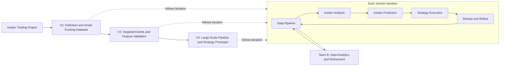

# Insider Trading Project Timeline

## Project Metadata

| Field | Value |
| --- | --- |
| Project Name | Insider Trading |
| Project Objective | Build a research-to-execution framework for detecting, verifying, predicting, and trading around insider-like activity on Polymarket. |
| Planning Period | One month |
| Product Owner | Amy Chen, Alex Yan, Alex Huang |
| R&D Leader | Junshi Wang, Owen |
| Final Deliverable | Data pipeline ready to deploy; Trade Signal Analysis; Tradable Strategy Prototype |
| Current Status | In Progress |

## Timeline Flow

## Status Legend

| Status | Meaning | Required Action |
| --- | --- | --- |
| Not Started | Task has not begun. | Confirm owner, scope, and expected deliverable. |
| In Progress | Owner is actively working on it. | Track blockers and expected completion date. |
| In Review | Draft output exists and needs review. | Product owner or R&D leader reviews and comments. |
| Blocked | Owner cannot proceed without help or dependency. | Record blocker and next decision needed. |
| Done | Deliverable is complete and accepted. | Record actual finish date and link output. |
| Deprecated | Task is no longer needed. | Record why it was removed or replaced. |

## Priority Legend

| Priority | Meaning |
| --- | --- |
| P0 | Must be completed for the project to be useful. |
| P1 | Important, but can be delayed if P0 work is not stable. |
| P2 | Useful extension or aggregated analysis after core work is complete. |

## Project Timeline (Team A)

| Main Project | Sub Project | Priority | Task | Requirements / Technical Documentation |
| --- | --- | --- | --- | --- |
| Insider Analysis | V1 - Insider Detection | P0 | Clear definition of insider trading | Produce a short report defining insider trading from legal and financial perspectives. Include academic literature where useful, especially quantitative definitions or measurable proxies for insider trading / informed trading. |
| Insider Analysis | V1 - Insider Detection | P0 | Polymarket insider trading market/event analysis | Based on the definition, analyze what kinds of Polymarket markets/events are likely to contain insider trading or insider-like activity. Identify representative categories, event structures, and why they are vulnerable. |
| Insider Analysis | V1 - Insider Detection | P0 | Summarization of insider trading feature sets | Summarize observable feature sets for detecting insider trading. Propose a theory-backed framework or algorithm that is likely to detect insider-like activity using historical Polymarket data. |
| Insider Analysis | V1 - Insider Verification | P0 | Naive insider trade verification method | Use known insider trades/cases only, then analyze their common properties. The goal is to build a simple baseline verification method before expanding to unknown candidates. |
| Insider Analysis | V1 - Insider Verification | P0 | Verify V1 insider candidates | Build evidence for whether detected candidates are truly insiders; distinguish confirmed, suspected, informed, whale, and false positive accounts. |
| Insider Analysis | V2 - Insider Detection | P0 | Validate individual features on ground-truth datasets | Test the V1 feature sets on small datasets where ground truth can be found. Validate each feature independently and analyze its accuracy, recall, false positives, and failure cases. |
| Insider Analysis | V2 - Insider Detection | P0 | Evaluate feature combinations | Combine validated features and evaluate them against the verification criteria. Identify which feature combinations perform best and explain why. |
| Insider Analysis | V2 - Insider Detection | P0 | Explore new insider detection features | Continue searching for new features based on improved understanding of the data, manual observations, and related academic papers. Document the hypothesis behind each new feature. |
| Insider Analysis | V2 - Insider Verification | P0 | Analyze no-ground-truth datasets and manually label suspicious trades | Apply the detection framework to datasets without ground truth, prioritizing politics and military markets. Identify highly suspicious trades/accounts and manually label them with supporting evidence. |
| Insider Analysis | V2 - Insider Verification | P0 | Build baseline feature evaluation and detection scoring criteria | Define a basic evaluation standard for features and detection results, including accuracy, recall, false positives, evidence strength, and an overall detection score. |
| Insider Analysis | V3 - Insider Detection | P1 | Large-scale feature and feature-combination testing | Run large-scale tests on known broad datasets to evaluate different insider detection features and their combinations. Compare performance, robustness, and failure modes across a much larger sample than V2. |
| Insider Analysis | V3 - Insider Detection | P1 | Representative market dataset analysis | Analyze representative datasets from different market categories and compare whether feature performance differs by market type. Check whether the results match the team's prior understanding of politics, military, sports, crypto, company/product, and other market categories. |
| Insider Analysis | V3 - Insider Detection | P1 | Success and failure case studies | Select both successful and failed detection cases for manual case study. Analyze how the algorithm found a suspected insider, or why it missed one, using trade data, market context, external search, and manual reasoning. |
| Insider Analysis | V3 - Insider Verification | P1 | AI-assisted insider verification workflow | Experiment with AI skills to reduce manual verification complexity. Let the AI retrieve context, analyze evidence, and flag suspicious insiders, then require final human validation before accepting any label. |
| Data Pipeline | V1 - Dataset Discovery | P0 | Find existing public datasets | Search for existing Polymarket / prediction market datasets that can support V1 insider analysis. Start from small, easy-to-understand datasets, then map which larger datasets should be downloaded later. No analysis work is required in this task. |
| Data Pipeline | V1 - Dataset Download | P0 | Download existing datasets from small to large scale | Download the selected existing datasets in staged order: small datasets first for fast iteration, then larger datasets after schema and storage assumptions are clear. Record source, coverage, file format, market scope, and download method. |
| Data Pipeline | V1 - Dataset Cleaning | P0 | Clean datasets and write preprocessing scripts | Clean V1 datasets and write preprocessing scripts. Normalize market ids, token ids, account ids, timestamps, outcomes, prices, trade/fill records, and missing or broken rows so insider analysis can consume the data reliably. |
| Data Pipeline | V2 - Dataset Discovery | P0 | Identify targeted politics and military events | Identify 1-5 politics and military events that are likely to contain insider-like activity. For each event, document why it has an insider feeling and why it is useful for applying the existing verification and analysis methods. |
| Data Pipeline | V2 - Dataset Download | P0 | Collect targeted event datasets from APIs and external sources | Use Gamma API, CLOB/orderbook APIs, Polymarket sources, or external websites to collect 1-5 day windows around selected politics and military events. For historical events, find and download archived data; for live events, write a crawler or API script to collect data going forward. |
| Data Pipeline | V2 - Dataset Cleaning | P0 | Clean targeted event datasets and prepare labels | Clean targeted event data, handle broken or missing records, align event timelines, normalize market/account/trade fields, and support manual labels from the verification workflow. The output should be ready for feature testing and suspicious-trade review. |
| Data Pipeline | V3 - Dataset Discovery | P1 | Define large-scale historical and real-time data requirements | Explore what data sources are required for broad multi-market coverage. Define requirements for historical data collection, real-time market tracking, market discovery, account tracking, event metadata, and downstream analysis access. |
| Data Pipeline | V3 - Dataset Download | P1 | Build historical pipeline and real-time crawler pipeline | Build two production-oriented collection pipelines: one for historical data and one for real-time crawling. The pipelines should collect data across different markets and preserve source metadata, timestamps, raw payloads, and reproducible update logs. |
| Data Pipeline | V3 - Dataset Cleaning | P1 | Build unified preprocessing pipeline and internal data API | Build a unified preprocessing and cleaning pipeline that exposes stable internal data APIs for the analysis team. The output should let analysis modules request cleaned markets, events, trades, accounts, labels, and feature-ready tables without manual data wrangling. |
| Insider Prediction | V1 - Algorithm Design | P0 | Design first real-time insider prediction algorithm | Use insider analysis findings to define how to predict whether an account or account group is insider-like using only information available at the time. |
| Insider Prediction | V1 - Algorithm Testing | P0 | Test V1 prediction algorithm | Evaluate V1 algorithm on historical replay without using future information; measure precision, recall, latency, and false positives. |
| Insider Prediction | V2 - Algorithm Design | P1 | Improve prediction algorithm | Add stronger features, account clustering, market-category priors, time-window logic, and confidence scoring. |
| Insider Prediction | V2 - Algorithm Testing | P1 | Test V2 prediction algorithm | Compare V2 against V1 with historical replay and document whether performance improves enough to support strategy execution. |
| Strategy Execution | V1 - Strategy Design | P0 | Design first alpha trading strategy | Define how to trade signals produced by insider prediction, including entry, sizing, exit, market selection, and risk controls. |
| Strategy Execution | V1 - Backtest Engine | P0 | Build first backtest engine | Build a historical replay engine that uses prediction signals and realistic trade assumptions to estimate tradability and PnL. |
| Strategy Execution | V1 - Strategy Evaluation | P0 | Evaluate V1 strategy | Evaluate profitability, drawdown, hit rate, capacity, turnover, market coverage, and sensitivity to fees/slippage/latency. |
| Strategy Execution | V2 - Strategy Design | P1 | Improve strategy design | Refine strategy rules using V1 results; add portfolio construction, account-confidence tiers, and market-level risk filters. |
| Strategy Execution | V2 - Backtest Engine | P1 | Improve backtest engine | Add more realistic execution assumptions, market liquidity constraints, delayed signal handling, and parameter sweeps. |
| Strategy Execution | V2 - Strategy Evaluation | P1 | Evaluate V2 strategy | Compare V2 against V1 and decide whether the alpha is strong enough for paper trading, live simulation, or deeper research. |

## Project Timeline (Team B)

| Version | Priority | Task | Requirements / Technical Documentation |
| --- | --- | --- | --- |
| V1 | P0 | Data exploration on existing datasets | Using Team A's small-to-large existing datasets, run exploratory data analysis on schema, coverage, market categories, timestamps, accounts, trades/fills, prices, missingness, duplicate records, and obvious data breaks. |
| V1 | P0 | Data visualization for baseline understanding | Build basic plots that help Team A understand the existing datasets: market coverage over time, volume distributions, account activity distributions, price/fill timelines, category coverage, and missing-data patterns. |
| V1 | P0 | Baseline data modeling and feature inventory | Convert initial data understanding into a baseline data model. Define core entities, relationships, and an initial feature inventory that can support Team A's insider analysis. |
| V1 | P0 | Raw-to-preprocessed cleaning workflow | Build a clear V1 cleaning workflow from raw data to preprocessed tables. Standardize ids, timestamps, markets, tokens, accounts, trades/fills, prices, outcomes, and broken rows. Document assumptions and validation checks. |
| V1 | P0 | Initial feature engineering support | Create first-pass features for Team A, such as account activity summaries, market participation, trade timing, position-size proxies, price movement around trades, and simple PnL-ready fields. |
| V2 | P0 | Event-level analytics on small real-time crawls | Using Team A's small-scale real-time crawled datasets, analyze event windows for selected politics and military markets. Compare historical vs real-time data quality, latency, missingness, and field consistency. |
| V2 | P0 | Event-level visualization and anomaly inspection | Build visualizations for event-level analysis: account activity windows, trade/fill timelines, price movement, volume bursts, new-wallet activity, repeated wallet participation, and suspicious-event patterns. |
| V2 | P0 | Refine preprocessing for event-window analysis | Improve preprocessing around event windows, market grouping, account activity windows, price/fill alignment, label joins, and news/event timestamp alignment. Reduce repeated manual cleaning for Team A. |
| V2 | P0 | Expand feature engineering for detection research | Add richer features that support Team A's feature testing: new/dormant wallet signals, timing-before-event features, market concentration, related-wallet activity, trade-size abnormality, and post-event behavior. |
| V2 | P0 | Label and annotation data model | Design a lightweight data model for labels from Team A's verification workflow, including suspicious trade labels, wallet/account labels, event labels, evidence links, reviewer, confidence, and label version. |
| V3 | P1 | Large-scale data analytics and monitoring | As Team A moves toward a full data crawling pipeline, build analytics that monitor dataset growth, crawler coverage, crawl latency, schema drift, missingness, broken markets, and market/category distribution at scale. |
| V3 | P1 | Unified visualization dashboard / report layer | Create repeatable visual reporting for large-scale datasets, including data quality, coverage, market-level activity, account-level activity, feature distributions, and suspicious-pattern summaries. |
| V3 | P1 | Unified raw-to-feature pipeline | Refine the full data workflow from raw data to preprocessing to feature engineering. The pipeline should produce stable, feature-ready tables across markets, events, trades, accounts, labels, prices, wallet relationships, and event timelines. |
| V3 | P1 | Feature library and internal data interface | Package the refined features and cleaned data into a reusable feature library or internal data interface so Team A can call standardized features without manual wrangling. |

## One-Month Planning View

| Week | Main Objective |
| --- | --- |
| Week 1 | Build background understanding: define insider trading, map Polymarket insider-like markets/events, clarify project scope, and align Team A / Team B responsibilities. |
| Week 2 | Use literature review and manual testing to form the first strategy prototype; begin collecting existing datasets and preparing the first data pipeline inputs. |
| Week 3 | Validate and iterate on the strategy and feature ideas using small-scale datasets; refine preprocessing, feature engineering, and manual verification criteria. |
| Week 4 | Prepare the real-time data pipeline and design a more complex adjusted strategy based on prior validation results, feature performance, and data limitations. |
